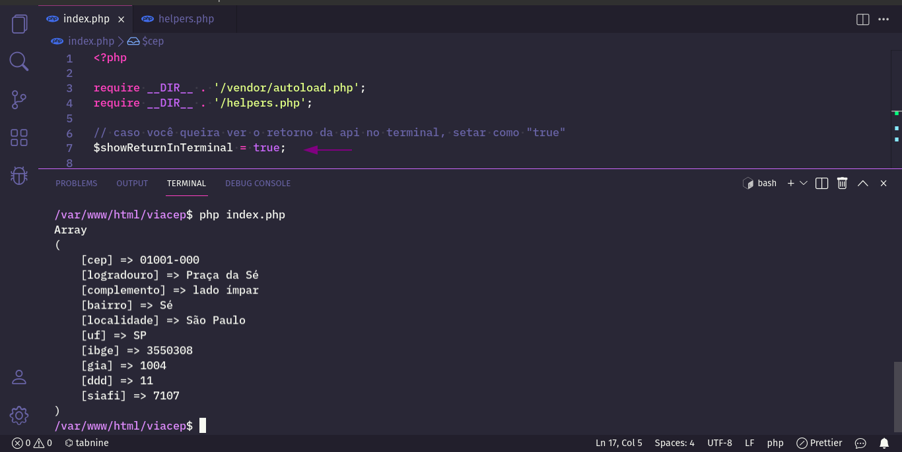
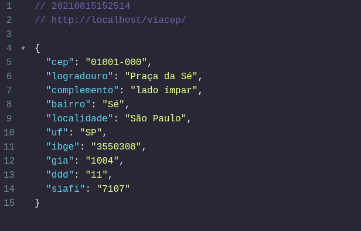
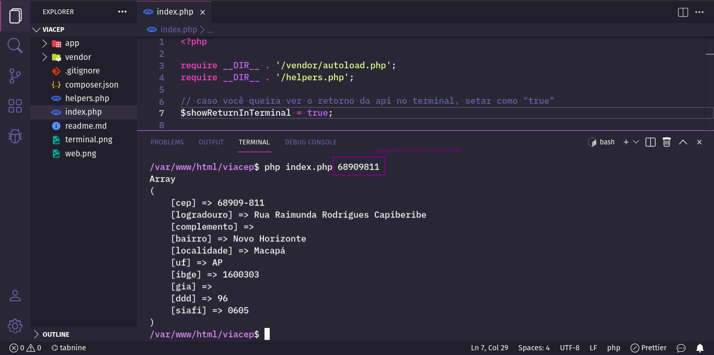

# Consultar (em PHP) um CEP na API ViaCEP

[viacep.com.br](https://viacep.com.br/)

Caso você queira ver a saída no terminal mesmo, mude a var ```$showReturnInTerminal``` para ```true```.
Caso queira ver no browser mesmo, basta acessar o localhost na pasta do projetinho.

Você pode passar um CEP na linha de comando ou simplesmente rodar o index.

Não se esqueça de rodar ```composer dump-autoload``` caso clone para sua máquina.





